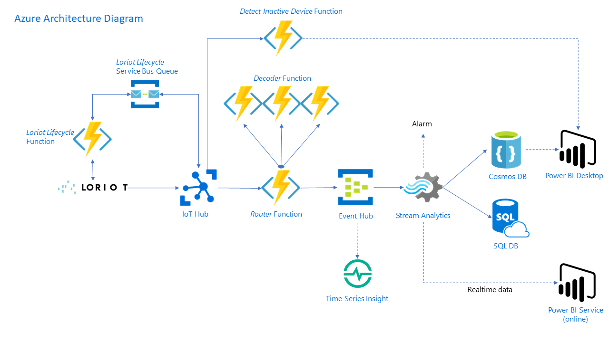
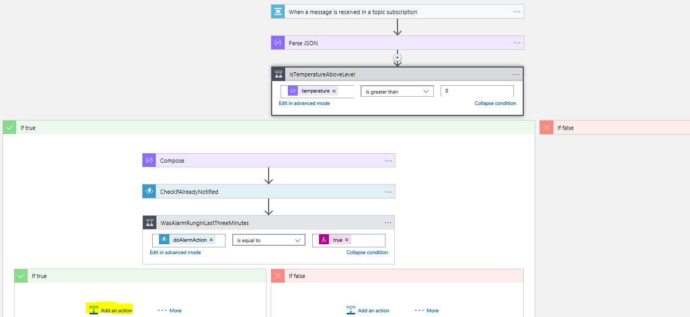

# Solution overview
This solution creates a simply deployable reference architecture that allows users to ingest, process, store, and analyze large quantities of sensor data coming from the [Loriot](#about-loriot) gateway on Microsoft Azure. Loriot customers will be able in a matter of no time to visualize data from their Lora connected devices in near real-time. The proposed solution could be a starting point for a more complex production-ready solution. 

Thanks to this architecture, end users can provision new IoT devices very quickly directly into their Azure subscription and synchronization will occur automatically back into their Loriot account. Thanks to the Loriot-Azure IoT Hub connector, inbound data from the sensors is collected by the IoT Hub and their payload can be decoded thanks to an extensible system of decoder functions. The solution implements data storage examples by storing sensor data in both SQL and Cosmos DB. 

In terms of visualization, the template includes a Power BI Dashboard with some preconfigured charts including realtime temperature data and an optional Time Series component allowing quick display of sensor data straight from the IoT Hub. Finally, the Power BI report is able to detect and display any inactive or broken devices.  



## Get Started

Please ensure you have your Loriot App ID / App Token / API URL, you will need it during deployment.

To deploy directly to Azure via the browser click the button below:

<a href="https://portal.azure.com/#create/Microsoft.Template/uri/https%3A%2F%2Fraw.githubusercontent.com%2FLoriot%2FAzureSolutionTemplate%2Fmaster%2Fazuredeploy.json" target="_blank">
    
</a>

To deploy to Azure via the commandline, first ensure you have the latest Azure CLI installed from [here](https://docs.microsoft.com/en-us/cli/azure/install-azure-cli?view=azure-cli-latest).
Run with the following command:

```powershell
az group deployment create --name ExampleDeployment --resource-group YourResourceGroup --template-file azuredeploy.json --parameters azuredeploy.parameters.json
```

Once the deployment has completed perform the following actions:
1. Navigate to the [Azure portal](https://portal.azure.com) and start the Stream Analytics job manually using the button at the top of the blade. For detailed instructions, please see the [power-bi](power-bi/) folder readme.
2. Add your new IoT Devices in Azure IoT Hub - the devices will be automatically provisioned in the Loriot Portal.
3. Add the Device Twin metadata as specified [here](#device-twin-setup).

## Solution Content

[IoT Hub](#iot-hub)
- [Device Twin Setup (Required)](#device-twin-setup)

[Azure Functions](#azure-functions)
- [Router Function](#router-function)
- [Setup Function](#setup-function)
- [Decoder Function](#decoder-function)
- [Detect Inactive Devices Function](#detect-inactive-devices-function)
- [Loriot Lifecycle Function](#loriot-lifecycle-function)
- [Function Environment Variables](#environment-variables):

    - [LORIOT_APP_ID](#loriot_app_id)
    - [LORIOT_API_KEY](#loriot_api_key)
    - [LORIOT_API_URL](#loriot_api_url)
    - [IOT_HUB_OWNER_CONNECTION_STRING](#iot_hub_owner_connection_string)
    - [EVENT_HUB_ROUTER_INPUT](#event_hub_router_input)
    - [EVENT_HUB_ROUTER_OUTPUT](#event_hub_router_output)
    - [DOCUMENT_DB_NAME](#document_db_name)
    - [DOCUMENT_DB_ACCESS_KEY](#document_db_access_key)
    - [SQL_DB_CONNECTION](#sql_db_connection)
    - [DEVICE_LIFECYCLE_CONNECTION_STRING](#device_lifecycle_connection_string)
    - [DEVICE_LIFECYCLE_QUEUE_NAME](#device_lifecycle_queue_name)
    - [DEVICE_LIFECYCLE_IMPORT_TIMER](#device_lifecycle_import_timer)

[Testing](#testing)
- [Device Emulation (Optional)](#device-emulation)

[Time Series Insights (Optional)](#time-series-insights)

[CosmosDB](#cosmos-db)

[Azure SQL Database](#azure-sql-database)

[Stream Analytics](#stream-analytics)

[Power BI (Optional)](#power-bi)

[Alarming (Optional)](#alarming)

[About Loriot](#about-loriot)


## IoT Hub
Azure IoT Hub is a scalable, multi-tenant cloud platform (IoT PaaS) that includes an IoT device registry, data storage, and security. It also provides a service interface to support IoT application development.

### Device Twin Setup

When adding new devices to the IoT Hub, ensure you modify the Device Twin to include the following tags in order for the routing function to assign the correct decoder:


Snippet provided below for easy copy-paste:
```json
"tags": {
    "sensorDecoder": "<decoderName>",
    "sensorName": "<sensorName>",
    "location": "<latitude,longitude>"
},
```

## Azure Functions: Description

Azure Functions is a solution for easily running small pieces of code, or "functions" in the cloud. You can write the code you need for the problem at hand, without worrying about a whole application or the infrastructure to run it. Azure Functions lets you develop serverless applications on Microsoft Azure.
In this project you will find the following functions:

### Router Function

The *router* function is triggered by messages coming from the IoT Hub (connection defined in the EVENTHUB_ROUTER_INPUT environment variable) and routes them to the appropriate decoder.

Routing is done based on the *sensordecoder* property present in the device twins tags in the IoT Hubs (connection defined in the IOT_HUB_OWNER_CONNECTION_STRING environment variable) - see [Device Twin Setup](#device-twin-setup) for more information. The function can access this information using the *iothub-connection-device-id* message property automatically added by the IoT Hub.
In a nutshell, routing takes the following strategy:

- If an environment variable with name "DECODER_URL_*sensordecoder*" or "DECODER_URL_DEFAULT_*sensordecoder*" exists, the message will be routed there.
- If those environment variables are not present in the web app, the message will be automatically routed to a function named after the *sensordecoder* located on the same function app. The route will be https://{nameOfCurrentFunctionApp}.azurewebsites.net/api/{*sensordecoder*}

The output of the function will be directed to an Event Hub (connection defined by EVENT_HUB_ROUTER_OUTPUT environment variable). Output messages are composed of the following subsections:

- MessageGuid: A unique GUID generated by the Router function to track each message.
- Raw: An exact copy of the raw message received from the IoT Hub.
- Metadata: Device twins tags from the IoT Hub (see [here](#device-twin-setup) for more detail).
- Decoded: Message from the IoT device decoded by the appropriate decoder.

### Setup Function

The setup function initializes the Cosmos DB collection and the SQL table needed by the pipeline. The function is automatically triggered at the end of the execution of the ARM template. It won't be called at later stage and is therefore not part of the standard application architecture. The function uses environment variables DOCUMENT_DB_NAME, DOCUMENT_DB_ACCESS_KEY and SQL_DB_CONNECTION to connect to the two resources.

If the collection or table already exists, the function will return without doing anything.

### Decoder Function

Decoder functions perform the decoding of the sensor raw data payload. By default, this solution provides three example decoders, however the system is built to be easily extensible. Additional decoders can be hosted anywhere and must simply be HTTP REST accessible and be routed to correctly by the [router function rules](#router-function).

Currently the decoder functions are written with no authentication required (Authorization.Anonymous in the function declaration). Although adding authentication at deploy time proved quite complicated, it is possible to add authentication to it after deployment easily by just adding an environment variable and a reference to the function code in the router function.

### Detect Inactive Devices Function

This function aims at detecting devices that stopped transmitting for a certain time. The function calls the IoT Hub and check all the device that were inactive during more than the allowed time window.

### Loriot Lifecycle Function

The lifecycle functions aimed at providing a synchronization between the Azure IoT Hub and the Loriot device portal.

- *ImportDevice* Function imports all devices present in the Loriot device portal to the IoT Hub. It will ensure no duplicates are created. This function exists as a time-triggered function to ensure regular syncing of new devices (*ScheduledImportDevice*) and a http triggered function named *ImportDevice* that could be used during development, testing or linked to be triggered by your custom UI.
- *ExportDevice* Function handles creation and deletion of devices event to the Loriot Portal. The messages are taken from the Device Lifecycle queue.

## Azure Functions: Environment variables

The function application uses a collection of environment variables populated at  ARM deploy time. This section contains a description and example of each variable.

#### LORIOT_APP_ID

The LORIOT App ID used to identify under which app the devices are synced.

```
BA7B0CF5
```

#### LORIOT_API_KEY

Key used to authenticate requests with LORIOT servers.

```
********************x9to
```

#### LORIOT_API_URL

The base URL of the Network Server Management API used to sync device information between Azure IoT Hub and LORIOT servers.

```
https://eu1.loriot.io/1/nwk/app/
```

#### IOT_HUB_OWNER_CONNECTION_STRING

The connection string for the IoT Hub used for device syncing and reading the device registry.

```
HostName=something.azure-devices.net;SharedAccessKeyName=iothubowner;SharedAccessKey=fU3Kw5M5J5QXP1QsFLRVjifZ1TeNSlFEFqJ7Xa5jiqo=
```

#### EVENT_HUB_ROUTER_INPUT

The connection string of the IoT Hub's Event Hub, used as trigger on the *Router* Function to send the messages to the appropriate decoders.

```
Endpoint=sb://something.servicebus.windows.net/;SharedAccessKeyName=iothubowner;SharedAccessKey=UDEL1prJ9THqLJel+uk8UeU8fZVkSSi2+CMrp5yrrWM=;EntityPath=iothubname;
SharedAccessKeyName=iothubowner
```

#### EVENT_HUB_ROUTER_OUTPUT

Connection string defining the output of the router function to the enriched and decoded message Event Hub.

```
Endpoint=sb://something.servicebus.windows.net/;SharedAccessKeyName=RootManageSharedAccessKey;SharedAccessKey=Ei8jNFRlH/rAjYKTTNxh7eIHlgeleffFekHhnyAxrZ4=
```

#### DOCUMENT_DB_NAME

Document Database name

#### DOCUMENT_DB_ACCESS_KEY

Key of the Document Database

#### SQL_DB_CONNECTION

Connection String of the SQL Database

```
Server=tcp:something.database.windows.net,1433;Initial Catalog=testdbmikou;Persist Security Info=False;
User ID=username;Password=password;MultipleActiveResultSets=False;Encrypt=True;TrustServerCertificate=False;Connection Timeout=30;
```

#### DEVICE_LIFECYCLE_CONNECTION_STRING

The connection string of the service bus queue carrying messages syncing between the Loriot IoT Hub and the device portal.

#### DEVICE_LIFECYCLE_QUEUE_NAME

The name of the service bus queue carrying messages syncing between the Loriot IoT Hub and the device portal.

#### DEVICE_LIFECYCLE_IMPORT_TIMER

The timer value that will call the *ScheduledImportDevice* function 

## Testing 
We do provide a ready to use testing setup in order to test and understand the infrastructure you deployed in a matter of minutes.

### Device Emulation

Provided with this project .Net Core console based emulator tool and a scrpit emulator that can be used to generate device messages to test the pipeline in the absence of a real device. 

For more information on the script tool, see the [test](test/) folder.

For more information on the .Net console tool, see the [LoraIoTHubTestTool](LoraIoTHubTestTool/) folder.

## Time Series Insights 

Azure Time Series Insights (TSI) is a fully managed analytics, storage, and visualization service that makes it simple to explore and analyze billions of IoT events simultaneously. It gives you a global view of your data, letting you quickly validate your IoT solution and avoid costly downtime to mission-critical devices by helping you discover hidden trends, spot anomalies, and conduct root-cause analyses in near real-time. 

### How to set it up?

Deployment of TSI is fully optional and can be toggled on and off without impacting other components. Data ingestion by the service is already configured, admin will have to grant access to the data dashboard to the users (TSI blade -> Data Access Policies --> Add). Users will then be able to see the data flowing in real time by going to the Time Series URL (displayed on the overview blade).

## Cosmos DB 

Azure Cosmos DB is Microsoft's globally distributed, multi-model database. With the click of a button, Azure Cosmos DB enables you to elastically and independently scale throughput and storage across any number of Azure's geographic regions.

This solution instantiates Cosmos DB using the documentDB API, allowing access to data using SQL-like queries. It is used in this default architecture to provide data to the offline Power BI client. 

## Azure SQL database

Azure SQL Database is the intelligent, fully-managed relational cloud database service built for developers. Accelerate app development and make maintenance easy and productive using the SQL tools you love to use. Take advantage of built-in intelligence that learns app patterns and adapts to maximize performance, reliability, and data protection. 

## Power BI

This deployment also provides (optional) Power BI visualization functionality as a starting point for data analysis (both realtime and historical). For instructions on how to make use of this capability please refer to the [power-bi](power-bi/) folder readme.

## Alarming

The alarming optional component will enable ability for users to set up an alarm based on their own settings using the [Microsoft Logic App workflow engine](https://docs.microsoft.com/en-us/azure/logic-apps/). A new Service bus, function and logic app will be added to the standard template. 

To configure correctly the alarming functionality of the base template, set a device twin tag named 'alarm' to true as shown below:
```
"tags": {
    "sensorDecoder": "SensorDecoderWeather",
    "sensorName": "Weather",
    "location": "47.4086576,8.5914313,16",
    "alarm": "true"
  }
```
By default, no alarm action is set in the logic app, in order to set one, please add a notification component in the Logic App as shown below in yellow. It could be anything from Outlook, gmail, Twilio (SMS),...


The alarming functionality use a function named "checkInterval" to ensure notifications are not sent too frequently. It uses a DocumentDB collection to save time when alarm last rang. It is possible to change alarm frequency in the function code, by default it is set to 3 minutes.
The logic app describes the alarming workflow. It is easy for a non-technical people to manipulate the datastream and add filters, actions and conditions. Currently the alarm is set to trigger for every temperature above 15 degrees and it will occur every 3 minutes at maximum. It is possible to change the temperature limit very easily and add your own logic into the data flow.


## About Loriot

LORIOT AG is a Swiss start-up in the field of Internet of Things, founded in 2015.
The core product today is software for scalable, distributed, resilient operation of LoRaWAN networks and end-to-end applications, which is offered under a variety of business models.
Due to their positioning in the LoRa ecosystem as both software provider and network operator, they are in direct contact with LoRa hardware producers and integrate many of their solutions directly with their services.
The collaboration allows them to offer not only network software, but a complete end-to-end solution for a real-world IoT application, including gateway and sensor hardware.
Their typical customers are small and medium enterprises in the Internet of Things business, cities, municipalities and wireless network operators.


