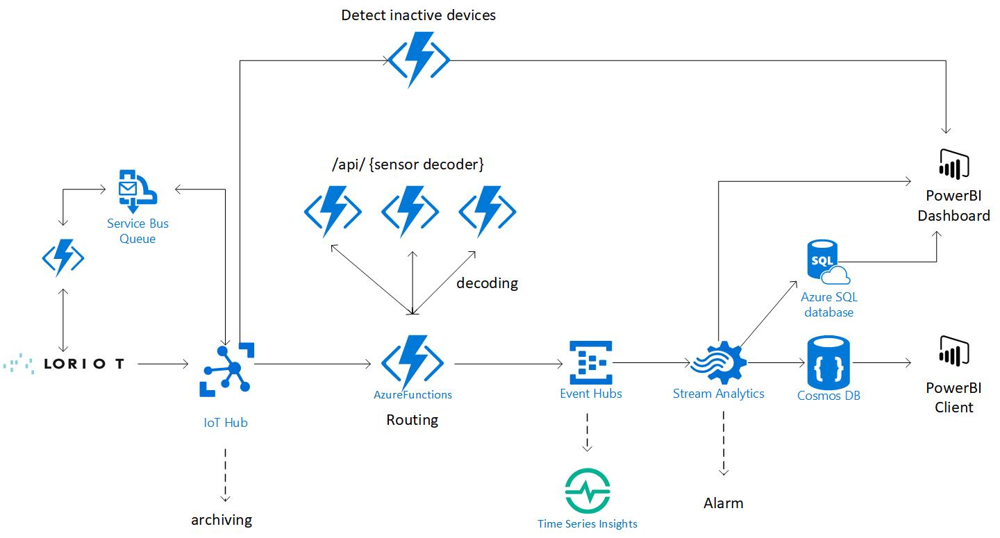

# AzureSolutionTemplate

<a href="https://portal.azure.com/#create/Microsoft.Template/uri/https%3A%2F%2Fraw.githubusercontent.com%2FLoriot%2FAzureSolutionTemplate%2Fmaster%2Fazuredeploy.json" target="_blank">
    
</a>

To run locally, ensure you have the latest Azure CLI installed from [here](https://docs.microsoft.com/en-us/cli/azure/install-azure-cli?view=azure-cli-latest). 
Run with the following command:
```
az group deployment create --name ExampleDeployment --resource-group YourResourceGroup --template-file azuredeploy.json --parameters azuredeploy.parameters.json
```


# Solution overview
This solution creates a simply deployable reference architecture in Azure that allows the user to ingest process store and analyze large quantity of sensor data coming in from the Loriot gateway.  This repository offers to Loriot customer an almost ready to use solution that allows them to quickly visualize Lora connected device data. This could be a starting point to a more complex productive solution. (link get started)

Loriot provides LoRaWAN software products and software services. With the new tool, customers can now provision the IOT infrastructure out of the Loriot Management Portal into the end customers Azure subscription with almost no configuration.  

The proposed solution allows the end user to provision new IOT devices very quickly into their Azure subscription and synchronize the device provisioning into the Loriot account. Thanks to the Loriot-Azure IoT Hub connector data can be easily collected by the IoT Hub and then decoded through a custom decoding Function. Through the optional Time Series component users can quickly analyze and display sensor data. The solution also implement an example how to store all sensor data to Cosmos DB and the example temperature data to SQL Database. The template alos offer a PowerBI Dashboard with some preconfigured charts including realtime temperature data. Furthermore the PowerBI report is able to detect and display inactive or broken devices.  



## Components ##


### Azure Functions ###
Azure Functions is a solution for easily running small pieces of code, or "functions" in the cloud. You can write the code you need for the problem at hand, without worrying about a whole application or the infrastructure to run it. Azure Functions lets you develop serverless applications on Microsoft Azure.


### Azure Event Hub ###
Azure Event Hubs is a highly scalable data streaming platform and event ingestion service capable of receiving and processing millions of events per second. Event Hubs can process and store events, data, or telemetry produced by distributed software and devices. Data sent to an event hub can be transformed and stored using any real-time analytics provider or batching/storage adapters. With the ability to provide publish-subscribe capabilities with low latency and at massive scale, Event Hubs serves as the "on ramp" for Big Data.

In our solution we use it for...(Mikhail) 

### Azure Stream Analytic ###
Azure Stream Analytics is a fully managed event-processing engine that lets you set up real-time analytic computations on streaming data. The data can come from devices, sensors, web sites, social media feeds, applications, infrastructure systems, and more. Use Stream Analytics to examine high volumes of data flowing from devices or processes, extract information from the data stream, and look for patterns, trends, and relationships. Based on what's in the data, you can then perform application tasks. For example, you might raise alerts, kick off automation workflows, feed information to a reporting tool such as Power BI, or store data for later investigation.


## Get Started
Prerequisites: 
Loriot Admin Portal and Azure Subscription

* Loriot App ID / App Token / API URL
* click the button
* fill in required information (solution Prefix need to be unique)
* Architecture diagram 

1. Add the IOT Devices in Azure IOT Hub, the devices will be automatically provisioned into the Loriot Portal
2. Add the Device Twin Meta Data as specified (here)
3. Monitor your device on this PowerBi

## About Loriot

LORIOT AG is a Swiss start-up in the field of Internet of Things, founded in 2015.
The core product today is software for scalable, distributed, resilient operation of LoRaWAN networks and end-to-end applications, which is offered under a variety of business models.
Due to their positioning in the LoRa ecosystem as both software provider and network operator, they are in direct contact with LoRa hardware producers and integrate many of their solutions directly with their services.
The collaboration allows them to offer not only network software, but a complete end-to-end solution for a real-world IoT application, including gateway and sensor hardware.
Their typical customers are small and medium enterprises in the Internet of Things business, cities, municipalities and wireless network operators.

# More Details

## Environment variables

### LORIOT_APP_ID

The LORIOT App Id used to identify under which app the devices are synced.

```
BA7B0CF5
```

### LORIOT_API_KEY

Key used to authenticate requests towards LORIOT servers.

```
********************x9to
```

### LORIOT_API_URL

The base URL of the Network Server Management API used to sync device information between Azure IoT Hub and LORIOT servers.

```
https://eu1.loriot.io/1/nwk/app/
```

### IOT_HUB_OWNER_CONNECTION_STRING

The connection string to the IoT Hub used for device syncing and reading the device registry.

```
HostName=something.azure-devices.net;SharedAccessKeyName=iothubowner;SharedAccessKey=fU3Kw5M5J5QXP1QsFLRVjifZ1TeNSlFEFqJ7Xa5jiqo=
```

### EVENT_HUB_ROUTER_INPUT

The connection string of the IoT Hub's Event Hub, used as trigger on the RouterFunction to send the messages to the appropriate decoders.

```
Endpoint=Endpoint=sb://something.servicebus.windows.net/;SharedAccessKeyName=iothubowner;SharedAccessKey=UDEL1prJ9THqLJel+uk8UeU8fZVkSSi2+CMrp5yrrWM=;EntityPath=iothubname;
SharedAccessKeyName=iothubowner;SharedAccessKey=2n/TlIoLJbMjmJOmadPU48G0gYfRCU28HeaL0ilkqMU=
```

### EVENT_HUB_ROUTER_OUTPUT

Connection string defining the output of the router function to the enriched and decoded message Event Hub.

```
Endpoint=sb://something.servicebus.windows.net/;SharedAccessKeyName=RootManageSharedAccessKey;SharedAccessKey=Ei8jNFRlH/rAjYKTTNxh7eIHlgeleffFekHhnyAxrZ4=
```

### DOCUMENT_DB_NAME

Document Database name

### DOCUMENT_DB_ACCESS_KEY

Key of the Document Database

### SQL_DB_CONNECTION

Connection String of the SQL Database

```
Server=tcp:something.database.windows.net,1433;Initial Catalog=testdbmikou;Persist Security Info=False;
User ID=username;Password=password;MultipleActiveResultSets=False;Encrypt=True;TrustServerCertificate=False;Connection Timeout=30;
```

### DEVICE_LIFECYCLE_CONNECTION_STRING

### DEVICE_LIFECYCLE_QUEUE_NAME

### DEVICE_LIFECYCLE_IMPORT_TIMER


## Router function

The router function is triggered by messages coming from the Iot Hub (connection defined in the EVENTHUB_ROUTER_INPUT environment variable) and route them to the appropriate decoder.  
Routing is done based on a *sensordecoder* property present in the device twins tags in the IoT Hubs (connection defined in the IOT_HUB_OWNER_CONNECTION_STRING environment variable).  The function can access this information using the *iothub-connection-device-id* message propertyautomatically added by the IoT Hub. 
In a nutshell, routing will  follow the following strategy: 

* if an environment variable with name "DECODER_URL_*sensordecoder*" or "DECODER_URL_DEFAULT_*sensordecoder*" exists, the message will be routed defined there.
* if those environment variables are not present in the web app. The message will be automatically routed to a function named after the *sensordecoder* located on the same function app. The route will be https://{nameOfCurrentFunctionApp}.azurewebsites.net/api/{*sensordecoder*} .

The output of the function will be directed in an eventhub (connection defined by EVENT_ROUTER_OUTPUT environment variable). Output messages are composed by the following subsection:
* MessageGuid: a unique GUID generated by the Router function to track each single message.
* Raw: an exact carbon copy of the raw message received from the IoT Hub.
* Metadata: Device twins tags present in the IoT Hub.
* Decoded: Decoded message from the IoT device decoded by the appropriate decoder.

## Setup function

Setup function is aimed at setting up the CosmosDb collection and and the SQL table needed by the general architecture. The function will be triggered at the end of the execution of the ARM template automatically. The function use environment variables DOCUMENT_DB_NAME, DOCUMENT_DB_ACCESS_KEY and SQL_DB_CONNECTION to be able to connect to the two ressources. 
In case the collection or tables already exist, the function return without doing nothing. 
