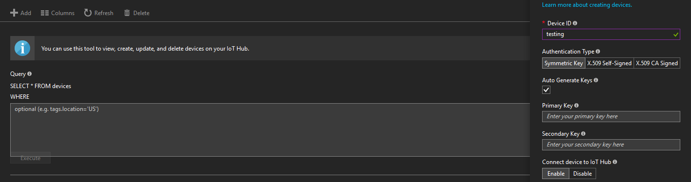

# Device Emulator Instructions

Included here is a script to be used for testing of the pipeline in the absence of a real device to connect.

Run with the following command:

```powershell
.\sendsensordata.ps1 -Hostname "<IoTHubHostname>" -SharedAccessKeyName "iothubowner" -SharedAccessKey "<iothubownerSharedAccessKey>" -DeviceId "<deviceID>" -SendCount <numberOfMessagesToGenerate>
```

Before running, you will need to complete a few steps:

1. Navigate to your IoT Hub in the [Azure portal](https://portal.azure.com). Copy your hostname from the 'Hostname' field in the Overview tab and use it as the 'Hostname' parameter.
2. Open up the Device Explorer from the menu on the left and click the plus button to add a device. Assign it a device ID and leave the rest of the fields as shown below. Use the device ID you just created as the 'DeviceId' parameter.



3. Navigate to the Shared Access Policies tab on the left. Click on the 'iothubowner' policy and use the primary key displayed as the 'SharedAccessKey' parameter.

Once these steps are complete, you can run the script to generate as many messages as required for testing. 

>Note: This will generate static data (see [getTestData.js](getTestData.js) for details), however the timestamp will update to match the current time for visualisation purposes.